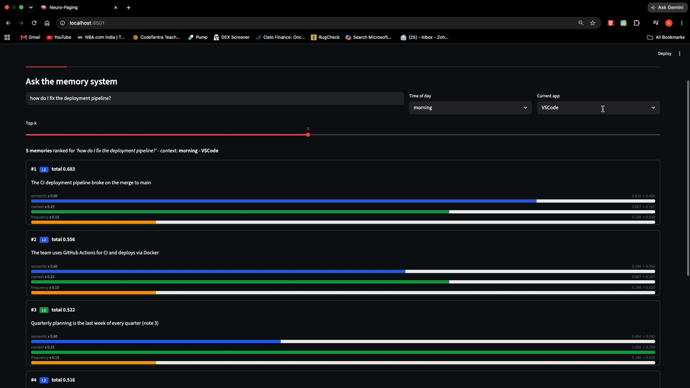

<div align="center">

# 🧠 Neuro-Paging

**An operating system for AI memory.**

*Tiered. Context-aware. 100% on-device.*

[](https://opensource.org/licenses/Apache-2.0)
[](https://www.python.org/downloads/)
[](#testing)
[](https://github.com/Ajay03299/Neuro-Paging/actions/workflows/ci.yml)

<br>



<em>Same text, different rank — the context term re-orders identical memories as the situation changes. Flat RAG would tie them.</em>
 s
</div>

---

## The idea

> Treat AI memory the way an operating system treats RAM. Page the right thoughts to the front of mind, keep the warm ones cached, archive the rest — and rank what to recall by *meaning, situation, and recency*, not just keyword match.

Most on-device agents store memory as one flat vector blob (every query scans everything; it slows as it grows) or a sliding window (forgets your routines and preferences). **Neuro-Paging is a third option: a tiered memory subsystem, not a RAG wrapper** — with semantic retrieval, context-aware ranking, and hard per-tier budgets, running entirely on-device.

| Flat RAG | Sliding Window | **Neuro-Paging** |
| :--- | :--- | :--- |
| One vector blob, scans everything, slows as it grows | Keeps last N turns, forgets routines & preferences | Tiered L1/L2/L3 with budgets, semantic + context-aware retrieval |

---

## Headline results

Everything below is **measured on Apple Silicon M3 Pro** and reproducible.

| What | Result | Where |
| :--- | :--- | :--- |
| **Retrieval quality** | **recall@5 = 0.98** on LongMemEval-S (all 5 ability types, ~48 sessions/q, on-device) | [eval/README.md](./eval/README.md) |
| **L1 insert latency** | **1.42 µs** p99 @ 32 KB (704× under the 1 ms target) | [BENCHMARKS.md](./BENCHMARKS.md) |
| **L2 query latency** | **0.78 ms** p50 @ 10K vectors (6.4× under 5 ms) | [BENCHMARKS.md](./BENCHMARKS.md) |
| **Test suite** | **216 tests** — example, concurrency (100 threads), property-based | [#testing](#testing) |
| **Native SIMD kernel** | Hand-written NEON beats **Accelerate BLAS by 1.16×** @ 50K candidates | [BENCHMARKS.md](./BENCHMARKS.md) |

---

## What's built

A complete, working, on-device memory system — store a fact, ask anything, get the semantically + contextually right memory back.

| Component | Status | Notes |
| :--- | :---: | :--- |
| **L1** working context (FIFO + byte budget) | ✅ | in-memory, 1.42 µs p99 insert |
| **L2** hot vector cache (HNSW + SQLite, atomic dual-store) | ✅ | 0.78 ms p50 query @ 10K |
| **L3** archive tier (HNSW + SQLite) | ✅ | cascade L1→L2→L3 end-to-end |
| **bge-small embeddings** (ONNX, no torch) | ✅ | semantic retrieval, ~90 MB, on-device |
| **Context-aware scorer** (α·cos + β·ctx + γ·freq·decay) | ✅ | ranks by meaning + situation + recency |
| **MemoryAgent** pipeline (remember / recall / respond) | ✅ | one interface over the whole system |
| **Pruner daemon** (cold L2→L3, power-gated) | ✅ | idle + battery aware |
| **Concurrency-safe** under multi-threaded load | ✅ | 9 stress tests, up to 100 threads |
| **LongMemEval recall@k harness** | ✅ | recall@5 = 0.98, oracle-validated |
| Live generation (llama.cpp / Qwen) | 🔭 future | pluggable behind a `Generator` protocol; default returns the assembled context |
| L3 PQ-int8 compression | 🔭 future | L3 is float32 HNSW today |
| Predictive prefetch (FP-Growth) | 🔭 future | designed; `promote()` hook exists |
| Consolidator (cluster → concept summary) | 🔭 future | — |
| Online α/β/γ weight learning | 🔭 future | weights are injected, so this slots in cleanly |
| **C++17 / ARM NEON kernel** (pybind11) | ✅ | beats Accelerate BLAS 1.16× @ 50K; thread sweep peaks at P-core count |

✅ = shipped & tested · 🔭 = future work (see [Future work](#future-work))

---

## How retrieval works

A query doesn't just match words. Every candidate memory is scored on three weighted terms:
Score(m | q, c) = α·cos(e_m, e_q)  +  β·ctxSim(tags_m, c)  +  γ·log(1 + freq_m)·decay(Δt)
└── semantic ──┘     └─── context ───┘     └──── recency/frequency ────┘

- **Semantic** (α = 0.60) — cosine similarity of bge-small embeddings. "Is this memory *about* the query?"
- **Context** (β = 0.25) — match between the memory's stored situation and the current one: time-of-day, foreground app, location, tag overlap. **The signal flat RAG throws away.**
- **Recency/frequency** (γ = 0.15) — `log(1+access_count)` × exponential decay (7-day half-life). Habits surface over one-offs; cold memories fade.

This is what makes "context-aware" literal. Two memories with **identical text** can rank very differently:

| Memory (same text) | Context | Total |
| :--- | :--- | ---: |
| "the CI deployment pipeline broke" | morning · in VSCode · used 12× · fresh | **0.86** |
| "the CI deployment pipeline broke" | night · in Netflix · never used · 20d old | **0.50** |

Same semantic score (0.83). Context and recency break the tie — flat RAG would rank them equal.

---

## Architecture
    query + context (time, app, location, recency)
                      │
                      ▼
    ┌──────────────────────────────────┐
    │  Context-Aware Scorer             │
    │  α·semantic + β·context + γ·freq  │
    └──────────────────────────────────┘
                      │ ranks candidates from all tiers
    ┌─────────────────┼─────────────────┐
    ▼                 ▼                 ▼
┌──────────────┐  ┌──────────────┐  ┌──────────────┐
│  L1 Working  │  │  L2 Hot      │  │  L3 Archive  │
│  ~32 KB      │  │  ~8 MB       │  │  128 MB      │
│  1.42 µs ✅  │  │  0.78 ms ✅  │  │  HNSW ✅     │
│  FIFO        │  │  HNSW+SQLite │  │  HNSW+SQLite │
└──────────────┘  └──────────────┘  └──────────────┘
▲   cascade L1→L2→L3 on overflow (shipped)   ▲
└─────────────────────┬─────────────────────┘
│
┌──────────────────────────────────┐
│  Pruner daemon — demotes cold     │
│  L2→L3, power & idle gated  ✅    │
└──────────────────────────────────┘

---

## Quick start

```bash
git clone https://github.com/Ajay03299/Neuro-Paging.git
cd Neuro-Paging

uv venv && source .venv/bin/activate
uv pip install -e ".[dev,ml]"     # ml extra pulls bge-small (ONNX)

python -c "import neuro_paging; print('✅', neuro_paging.__version__)"
pytest tests/ -q
```

### 30-second taste

```python
from neuro_paging.pipeline import MemoryAgent
from neuro_paging.embed import BGESmallEmbedder
from neuro_paging.routing import ContextAwareScorer
from neuro_paging.context import ContextTags

emb = BGESmallEmbedder()                                  # bge-small via ONNX
agent = MemoryAgent(
    data_dir="./my-memory",
    embedder=emb,
    scorer=ContextAwareScorer(embedder=emb),
)

ctx = ContextTags.now()
agent.remember("the user is allergic to peanuts", ctx)
agent.remember("deployment uses GitHub Actions", ctx)

print(agent.respond("what are the user's dietary needs?", ctx))
# → surfaces the peanut-allergy memory, ranked by relevance + context

agent.close()
```

---

## Testing

**216 tests**, all passing, CI-enforced across Python 3.11 and 3.12, in three styles:

- **Example-based** — correctness on known scenarios across every component.
- **Concurrency stress** (9 tests) — hammer L1/L2/L3 and the pruner from up to **100 threads**, verifying dual-store atomicity (HNSW + SQLite never diverge), race-free label assignment, and byte-budget invariants under contention. A global `pytest-timeout` (thread method) makes any deadlock regression fail fast with a thread dump instead of wedging CI.
- **Property-based** (Hypothesis) — encode invariants like *"the byte budget is never exceeded for any insert sequence"* and let Hypothesis generate hundreds of cases trying to break them, shrinking any failure to a minimal reproducer.

```bash
pytest tests/ -q                       # all 216
pytest tests/test_concurrency.py -v    # the 9 stress tests
pytest tests/test_properties.py -v     # Hypothesis property tests
```

---

## Evaluation

Retrieval recall@k on **LongMemEval** (ICLR 2025), the long-term-memory benchmark — full methodology in [eval/README.md](./eval/README.md).

| recall@1 | recall@3 | recall@5 | recall@10 |
| ---: | ---: | ---: | ---: |
| 0.90 | 0.96 | **0.98** | 0.98 |

50 questions stride-sampled across all five ability types, ~48 sessions each, bge-small (ONNX), on-device. Retrieval-only (not official LongMemEval accuracy scores). The harness was validated on the `oracle` split first (recall = 1.0 by construction) to separate harness correctness from retrieval difficulty.

```bash
python eval/longmemeval.py --split oracle --limit 50   # validate harness (~1.0)
python eval/longmemeval.py --split s --limit 50        # the headline number
```

---

## Repository layout
Neuro-Paging/
├── src/neuro_paging/
│   ├── memory/       # L1/L2/L3 tiers + MemoryManager      ✅
│   ├── embed/        # bge-small ONNX embedder             ✅
│   ├── routing/      # context-aware scorer                ✅
│   ├── pipeline/     # MemoryAgent (remember/recall/respond) ✅
│   ├── daemons/      # power-gated pruner                  ✅
│   └── context/      # context tags + sensor types         ✅
├── npaged-core/      # C++17 NEON SIMD kernel (pybind11)    ✅
├── bench/            # latency / throughput benchmarks      ✅
├── eval/             # LongMemEval recall@k harness         ✅
├── tests/            # 216 tests (example/concurrency/property)
├── notes/            # baselines, design decisions
└── BENCHMARKS.md     # consolidated measured results

---

## Future work

Documented, not built — the architecture leaves clean seams for each:

- **Live generation** — a `Generator` protocol already exists; the default returns the assembled context block. A local LLM (llama.cpp + Qwen2.5-1.5B) drops in without touching the pipeline.
- **L3 PQ-int8 compression** — L3 is float32 HNSW today; product quantization would cut its footprint ~4×.
- **Predictive prefetch** — FP-Growth over `(time, app, topic)` routines to warm L1 before a query; the `promote()` hook is in place.
- **Consolidator** — cluster + summarize stale memories into dense concepts.
- **Online weight learning** — α/β/γ are injected, not hard-coded, so per-user adaptation from implicit feedback slots in cleanly.

---

## Tech & models

**Embeddings:** [bge-small-en-v1.5](https://huggingface.co/BAAI/bge-small-en-v1.5) (MIT), served via **ONNX Runtime** (no torch). **Vector index:** hnswlib (HNSW, cosine). **Metadata:** SQLite (WAL). **Scheduling:** APScheduler. **Eval dataset:** [LongMemEval-cleaned](https://huggingface.co/datasets/xiaowu0162/longmemeval-cleaned). All dependencies are permissively licensed and run locally — no cloud calls at runtime.

---

## About

Built solo by **Ajay Javali** (IIIT-Bangalore, B.Tech CSE) as a from-scratch systems + ML project: the tiered substrate, the ONNX embedding runtime, the context-aware scorer, the pipeline, the concurrency and property-based test suites, the benchmarks, and the LongMemEval evaluation. Originally prototyped with a collaborator who has since departed; all current code is my own.

---

## License

Apache License 2.0 — see [LICENSE](./LICENSE).